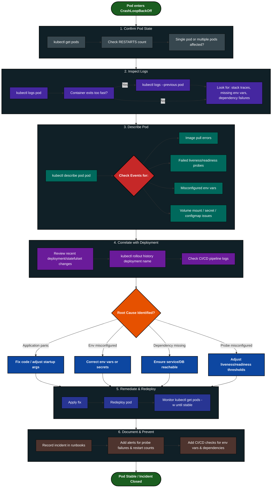
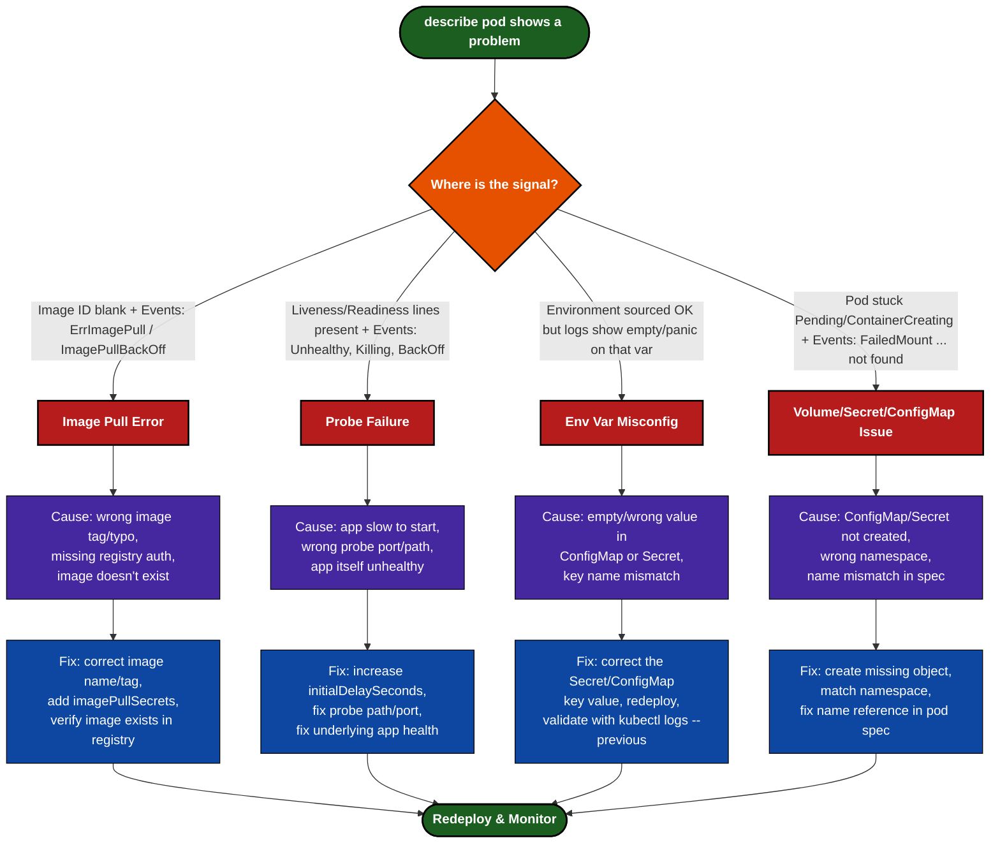

```
CrashLoopBackOff — Example Error Outputs

Four example kubectl describe pod <pod> outputs, each showing a different root cause.

1. Image Pull Error
Name:             web-app-7d9f8c6b5-xk2p1
Namespace:        default
Priority:         0
Node:             worker-node-2/172.18.0.5
Start Time:       Thu, 20 Aug 2026 09:12:03 +0000
Labels:           app=web-app
Status:           Pending
IP:               <none>
Containers:
  web-app:
    Container ID:
    Image:          myregistry.io/web-app:v2.4.1-typo
    Image ID:
    Port:           8080/TCP
    Host Port:      0/TCP
    State:          Waiting
      Reason:       ImagePullBackOff
    Ready:          False
    Restart Count:  0
    Environment:    <none>
    Mounts:
      /var/run/secrets/kubernetes.io/serviceaccount from kube-api-access-9f2xk (ro)
Conditions:
  Type              Status
  Initialized       True
  Ready             False
  ContainersReady   False
  PodScheduled      True
Events:
  Type     Reason     Age                    From               Message
  ----     ------     ----                   ----               -------
  Normal   Scheduled  3m12s                  default-scheduler  Successfully assigned default/web-app-7d9f8c6b5-xk2p1 to worker-node-2
  Normal   Pulling    2m5s (x4 over 3m10s)   kubelet            Pulling image "myregistry.io/web-app:v2.4.1-typo"
  Warning  Failed     2m3s (x4 over 3m8s)    kubelet            Failed to pull image "myregistry.io/web-app:v2.4.1-typo": rpc error: code = NotFound desc = failed to pull and unpack image: myregistry.io/web-app:v2.4.1-typo: not found
  Warning  Failed     2m3s (x4 over 3m8s)    kubelet            Error: ErrImagePull
  Normal   BackOff    118s (x6 over 3m7s)    kubelet            Back-off pulling image "myregistry.io/web-app:v2.4.1-typo"
  Warning  Failed     105s (x6 over 3m7s)    kubelet            Error: ImagePullBackOff

Signal: Image ID: is blank, State: Waiting / Reason: ImagePullBackOff, and Events repeat Failed to pull image → ErrImagePull → ImagePullBackOff. Likely cause: wrong tag/typo in image name, private registry auth missing, or image genuinely doesn't exist.

2. Failed Liveness/Readiness Probe
Name:             api-server-6c7f9d8b4-mz7lq
Namespace:        default
Priority:         0
Node:             worker-node-1/172.18.0.4
Start Time:       Thu, 20 Aug 2026 09:20:11 +0000
Labels:           app=api-server
Status:           Running
IP:               10.42.0.23
Containers:
  api-server:
    Container ID:  containerd://a1b2c3d4e5f6...
    Image:         myregistry.io/api-server:v1.9.0
    Image ID:      docker.io/myregistry.io/api-server@sha256:abc123...
    Port:          8080/TCP
    State:          Running
      Started:      Thu, 20 Aug 2026 09:24:40 +0000
    Last State:     Terminated
      Reason:       Error
      Exit Code:    137
      Started:      Thu, 20 Aug 2026 09:22:10 +0000
      Finished:     Thu, 20 Aug 2026 09:24:35 +0000
    Ready:          False
    Restart Count:  5
    Liveness:       http-get http://:8080/healthz delay=5s timeout=1s period=10s #success=1 #failure=3
    Readiness:      http-get http://:8080/ready delay=5s timeout=1s period=5s #success=1 #failure=3
    Environment:    <none>
Conditions:
  Type              Status
  Initialized       True
  Ready             False
  ContainersReady   False
  PodScheduled      True
Events:
  Type     Reason     Age                  From     Message
  ----     ------     ----                 ----     -------
  Normal   Pulled     4m ago               kubelet  Container image already present on machine
  Normal   Created    4m ago               kubelet  Created container api-server
  Normal   Started    4m ago               kubelet  Started container api-server
  Warning  Unhealthy  2m30s (x8 over 3m)   kubelet  Liveness probe failed: Get "http://10.42.0.23:8080/healthz": dial tcp 10.42.0.23:8080: connect: connection refused
  Warning  Unhealthy  2m20s (x6 over 2m50s) kubelet Readiness probe failed: HTTP probe failed with statuscode: 503
  Normal   Killing    2m15s                kubelet  Container api-server failed liveness probe, will be restarted
  Warning  BackOff    1m30s (x3 over 2m)   kubelet  Back-off restarting failed container

Signal: Liveness:/Readiness: lines present, Restart Count climbing, Last State: Terminated / Exit Code: 137, and Events show Unhealthy → Killing → BackOff. Likely cause: app takes longer to start than delay/period allow, wrong probe port/path, or the app itself is unhealthy (crashing internally, slow dependency).

3. Misconfigured Environment Variables
Name:             payment-service-5f8b9c7d6-tq4vn
Namespace:        default
Priority:         0
Node:             worker-node-3/172.18.0.6
Start Time:       Thu, 20 Aug 2026 09:30:02 +0000
Labels:           app=payment-service
Status:           Running
IP:               10.42.0.31
Containers:
  payment-service:
    Container ID:  containerd://f9e8d7c6b5a4...
    Image:         myregistry.io/payment-service:v3.2.0
    Image ID:      docker.io/myregistry.io/payment-service@sha256:def456...
    Port:          9090/TCP
    State:          Waiting
      Reason:       CrashLoopBackOff
    Last State:     Terminated
      Reason:       Error
      Exit Code:    1
      Started:      Thu, 20 Aug 2026 09:31:50 +0000
      Finished:     Thu, 20 Aug 2026 09:31:52 +0000
    Ready:          False
    Restart Count:  9
    Environment:
      DB_HOST:      <set to the key 'host' of config map 'payment-db-config'>  Optional: false
      DB_PASSWORD:  <set to the key 'password' in secret 'payment-db-secret'>  Optional: false
      STRIPE_KEY:   <set to the key 'stripe-key' in secret 'payment-secrets'>  Optional: false
Conditions:
  Type              Status
  Initialized       True
  Ready             False
  ContainersReady   False
  PodScheduled      True
Events:
  Type     Reason     Age                   From     Message
  ----     ------     ----                  ----     -------
  Normal   Pulled     3m ago                kubelet  Container image already present on machine
  Normal   Created    3m ago                kubelet  Created container payment-service
  Normal   Started    3m ago                kubelet  Started container payment-service
  Warning  BackOff    45s (x9 over 2m50s)   kubelet  Back-off restarting failed container
$ kubectl logs payment-service-5f8b9c7d6-tq4vn --previous
panic: STRIPE_KEY environment variable is empty, cannot initialize payment client
goroutine 1 [running]:
main.initStripeClient(...)
	/app/payment/stripe.go:42
main.main()
	/app/main.go:28 +0x1a5

Signal: Environment: shows the variable sourced correctly from a ConfigMap/Secret, but kubectl logs --previous reveals the actual value resolved empty — meaning the key exists in the reference but the ConfigMap/Secret key itself has no value (or a wrong key name was referenced upstream). Likely cause: empty/wrong value in the Secret, key name mismatch, or the wrong Secret/ConfigMap version deployed.

4. Volume Mount / Secret / ConfigMap Issue
Name:             worker-job-8d6c5b4a3-vn9pl
Namespace:        default
Priority:         0
Node:             worker-node-1/172.18.0.4
Start Time:       Thu, 20 Aug 2026 09:40:15 +0000
Labels:           app=worker-job
Status:           Pending
IP:               <none>
Containers:
  worker-job:
    Container ID:
    Image:         myregistry.io/worker-job:v1.0.3
    Image ID:
    Port:          <none>
    State:          Waiting
      Reason:       ContainerCreating
    Ready:          False
    Restart Count:  0
    Environment:    <none>
    Mounts:
      /etc/config from app-config (rw)
      /etc/secrets from app-secrets (rw)
      /var/run/secrets/kubernetes.io/serviceaccount from kube-api-access-7lm2q (ro)
Conditions:
  Type              Status
  Initialized       True
  Ready             False
  ContainersReady   False
  PodScheduled      True
Volumes:
  app-config:
    Type:       ConfigMap
    Name:       worker-job-config
    Optional:   false
  app-secrets:
    Type:       Secret
    SecretName: worker-job-secrets
    Optional:   false
Events:
  Type     Reason       Age                 From               Message
  ----     ------       ----                ----               -------
  Normal   Scheduled    2m ago              default-scheduler  Successfully assigned default/worker-job-8d6c5b4a3-vn9pl to worker-node-1
  Warning  FailedMount  38s (x8 over 2m)    kubelet            MountVolume.SetUp failed for volume "app-config" : configmap "worker-job-config" not found
  Warning  FailedMount  20s (x9 over 2m)    kubelet            MountVolume.SetUp failed for volume "app-secrets" : secret "worker-job-secrets" not found

Signal: Pod stuck in Pending / ContainerCreating, Image ID never populates (container never starts), and Events repeatedly show FailedMount ... not found. Likely cause: ConfigMap/Secret not created, created in the wrong namespace, or name mismatch between the Deployment spec and the actual object.

```




