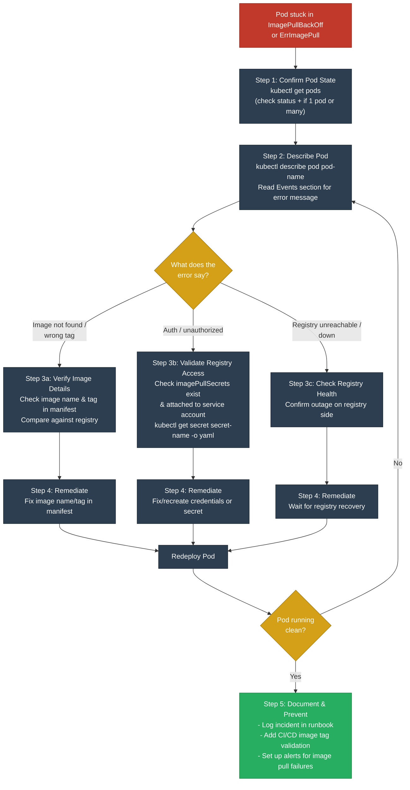

```
Question 3: ImagePullBackOff / ErrImagePull
Scenario: You deploy a new Kubernetes workload, but the pod fails to start and enters an ImagePullBackOff or ErrImagePull state. The cluster cannot pull the container image from the registry.

Why This Question Matters:
•	Tests Kubernetes debugging.
•	Evaluates logs and events.
•	Checks systematic troubleshooting.
•	Differentiates app vs infra.

Demonstrate Systematic Troubleshooting in Your Answer:

•First, confirm the pod state. Run kubectl get pods to verify the pod is in ImagePullBackOff or ErrImagePull.

•Next, describe the pod. Use kubectl describe pod <pod> to check events. Look for messages like: Failed to pull image "<image>": rpc error: code = Unknown desc = Error response from daemon.

•Then, verify the image details. Check the image name and tag in the deployment manifest. Ensure the image exists in the registry and the tag matches the latest build.

•After that, validate registry access. If it’s a private registry, confirm that imagePullSecrets are correctly configured and attached to the service account. Run kubectl get secret <secret-name> -o yaml to verify credentials.

•Finally, remediate. Correct the image name or tag, fix registry credentials, or wait for registry recovery if it’s a downtime issue. Redeploy the pod once verified.


Incorrect Approach
•	Blindly restarting pods without checking events.
•	Assuming the image exists without verifying the tag.
•	Ignoring private registry authentication.
•	Not correlating with CI/CD image push logs.


Your Answer Should Be:
If I deploy a workload and see a pod stuck in ImagePullBackOff, I start by running kubectl get pods just to confirm its status. Next, I'll run kubectl describe pod to look at the events and see what the actual error message says. If it's a bad image name or an auth failure, I check the deployment manifest to make sure the tag is right. If we're using a private registry, I double-check that the imagePullSecrets are properly set up and attached. And if the registry itself is just down, you have to wait for it to recover before you can redeploy. Ultimately, it's all about checking your image tags, credentials, and registry health first instead of just restarting things blindly.

Practice Answering in a Structured, Step by Step Way:
1.	Confirm Pod State Run kubectl get pods to verify the pod is in ImagePullBackOff. Check if multiple pods are affected or just one.
2.	Describe Pod Run kubectl describe pod <pod> to check events. Look for image pull errors or authentication failures.
3.	Verify Image Details Check image name and tag in the manifest. Ensure the image exists in the registry and matches the latest build.
4.	Validate Registry Access Confirm imagePullSecrets are configured correctly. Run kubectl get secret <secret-name> -o yaml to inspect credentials.
5.	Decide on Remediation Fix image name/tag, correct credentials, or wait for registry recovery. Redeploy and monitor pod startup.
6.	Document & Prevent Record the incident in runbooks. Add CI/CD validation for image tags and registry credentials. Implement alerts for image pull failures.

```





