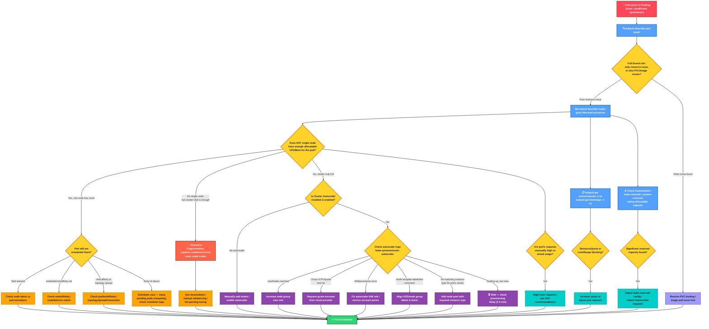

```mermaid
flowchart TD
    ROOT["🚨 Pod Pending<br/>Insufficient CPU/Memory"]:::rootStyle

    ROOT --> C1["1️⃣ Genuine Capacity<br/>Shortage"]:::red
    C1 --> C1a["No node has enough<br/>allocatable CPU/Mem"]:::redLeaf
    C1 --> C1b["Cluster Autoscaler<br/>absent or disabled"]:::redLeaf
    C1 --> C1c["Autoscaler hit<br/>maxNodes limit"]:::redLeaf
    C1 --> C1d["Required instance type<br/>missing (GPU/high-mem)"]:::redLeaf

    ROOT --> C2["2️⃣ Over-Provisioned<br/>Requests"]:::orange
    C2 --> C2a["Requests set too high<br/>vs actual usage"]:::orangeLeaf
    C2 --> C2b["VPA/templates inflated<br/>requests automatically"]:::orangeLeaf
    C2 --> C2c["No node satisfies request<br/>despite low real usage"]:::orangeLeaf

    ROOT --> C3["3️⃣ Resource<br/>Fragmentation"]:::yellow
    C3 --> C3a["Enough total free capacity<br/>across cluster"]:::yellowLeaf
    C3 --> C3b["Scattered in small pockets<br/>on many nodes"]:::yellowLeaf
    C3 --> C3c["No single node has<br/>contiguous capacity"]:::yellowLeaf

    ROOT --> C4["4️⃣ Node<br/>Reservations"]:::green
    C4 --> C4a["kube-reserved /<br/>system-reserved"]:::greenLeaf
    C4 --> C4b["Eviction thresholds reduce<br/>allocatable capacity"]:::greenLeaf
    C4 --> C4c["DaemonSets consume<br/>requests on every node"]:::greenLeaf
    C4 --> C4d["Logging agents, CNI,<br/>service mesh sidecars"]:::greenLeaf

    ROOT --> C5["5️⃣ Scheduling<br/>Constraints"]:::teal
    C5 --> C5a["Taints without<br/>matching tolerations"]:::tealLeaf
    C5 --> C5b["nodeSelector/nodeAffinity<br/>restricts to full nodes"]:::tealLeaf
    C5 --> C5c["Pod anti-affinity blocks<br/>co-location"]:::tealLeaf
    C5 --> C5d["Topology spread constraints<br/>prevent packing"]:::tealLeaf
    C5 --> C5e["PodDisruptionBudget races<br/>with scale-down"]:::tealLeaf

    ROOT --> C6["6️⃣ Namespace<br/>Policy Limits"]:::blue
    C6 --> C6a["ResourceQuota caps total<br/>CPU/Mem requests"]:::blueLeaf
    C6 --> C6b["LimitRange default/min/max<br/>conflicts with pod spec"]:::blueLeaf

    ROOT --> C7["7️⃣ Autoscaler<br/>Slow or Broken"]:::purple
    C7 --> C7a["Scale-up in progress,<br/>cloud provisioning delay"]:::purpleLeaf
    C7 --> C7b["Cloud vCPU/instance<br/>quota exhausted"]:::purpleLeaf
    C7 --> C7c["IAM/permission errors<br/>block node creation"]:::purpleLeaf
    C7 --> C7d["Node group template<br/>label/taint mismatch"]:::purpleLeaf

    ROOT --> C8["8️⃣ Scheduler<br/>Scoring Effects"]:::pink
    C8 --> C8a["Many pending pods<br/>competing for same nodes"]:::pinkLeaf
    C8 --> C8b["NodeResourcesFit /<br/>PodTopologySpread scoring"]:::pinkLeaf
    C8 --> C8c["Pod loses the scheduling<br/>race repeatedly"]:::pinkLeaf

    ROOT --> C9["9️⃣ Misleading<br/>Root Cause"]:::gray
    C9 --> C9a["Reported as resource issue<br/>but really PVC unbound"]:::grayLeaf
    C9 --> C9b["Or image pull happening<br/>after scheduling"]:::grayLeaf
    C9 --> C9c["Multiple predicates fail;<br/>only one shown in Events"]:::grayLeaf

    classDef rootStyle fill:#ff1744,color:#ffffff,stroke:#000000,stroke-width:4px,font-weight:bold
    classDef red fill:#ff5252,color:#ffffff,stroke:#b71c1c,stroke-width:3px,font-weight:bold
    classDef redLeaf fill:#ffcdd2,color:#000000,stroke:#b71c1c,stroke-width:2px,font-weight:bold
    classDef orange fill:#ff9100,color:#000000,stroke:#e65100,stroke-width:3px,font-weight:bold
    classDef orangeLeaf fill:#ffe0b2,color:#000000,stroke:#e65100,stroke-width:2px,font-weight:bold
    classDef yellow fill:#ffea00,color:#000000,stroke:#f57f17,stroke-width:3px,font-weight:bold
    classDef yellowLeaf fill:#fff9c4,color:#000000,stroke:#f57f17,stroke-width:2px,font-weight:bold
    classDef green fill:#00e676,color:#000000,stroke:#1b5e20,stroke-width:3px,font-weight:bold
    classDef greenLeaf fill:#c8e6c9,color:#000000,stroke:#1b5e20,stroke-width:2px,font-weight:bold
    classDef teal fill:#1de9b6,color:#000000,stroke:#00695c,stroke-width:3px,font-weight:bold
    classDef tealLeaf fill:#b2dfdb,color:#000000,stroke:#00695c,stroke-width:2px,font-weight:bold
    classDef blue fill:#2979ff,color:#ffffff,stroke:#0d47a1,stroke-width:3px,font-weight:bold
    classDef blueLeaf fill:#bbdefb,color:#000000,stroke:#0d47a1,stroke-width:2px,font-weight:bold
    classDef purple fill:#d500f9,color:#ffffff,stroke:#6a1b9a,stroke-width:3px,font-weight:bold
    classDef purpleLeaf fill:#e1bee7,color:#000000,stroke:#6a1b9a,stroke-width:2px,font-weight:bold
    classDef pink fill:#ff4081,color:#ffffff,stroke:#ad1457,stroke-width:3px,font-weight:bold
    classDef pinkLeaf fill:#f8bbd0,color:#000000,stroke:#ad1457,stroke-width:2px,font-weight:bold
    classDef gray fill:#78909c,color:#ffffff,stroke:#263238,stroke-width:3px,font-weight:bold
    classDef grayLeaf fill:#cfd8dc,color:#000000,stroke:#263238,stroke-width:2px,font-weight:bold

```

```
Pods stay stuck in `Pending` with "Insufficient cpu" / "Insufficient memory" events for a handful of distinct underlying reasons. Here's a breakdown of the common causes:

```
```
```
1. Cluster genuinely lacks capacity
- No node has enough allocatable CPU/memory for the pod's `requests` — not the actual usage, but the sum of all requests already scheduled on each node.
- Cluster autoscaler is absent, disabled, or capped (`maxNodes` already reached), so no new node gets added to relieve pressure.
- Node pool/instance type mismatch — the pod needs a GPU, large memory, or specific instance family that doesn't exist in any node group.

2. Requests are set too high (over-provisioning)
- Developers set generous `resources.requests` "just to be safe," and no single node can satisfy that request even though real usage is low.
- Vertical Pod Autoscaler or a manifest template inflated requests without anyone noticing.

3. Resource fragmentation
- Enough total free CPU/memory exists across the cluster, but it's scattered in small pockets on many nodes — no single node has enough contiguous allocatable capacity for one pod.

4. Node-level reservations eating into allocatable resources
- `kube-reserved`, `system-reserved`, and eviction thresholds reduce "allocatable" below what raw node capacity suggests.
- DaemonSets (logging agents, CNI, service mesh sidecar injectors) consume requests on every node, shrinking what's left for regular pods.

5. Taints, tolerations, affinity/anti-affinity, and topology constraints
- Nodes with free capacity exist but are tainted (e.g., dedicated node pools) and the pod lacks matching tolerations.
- nodeSelector / nodeAffinity restricts scheduling to a subset of nodes that happen to be full.
- Pod anti-affinity or topology spread constraints prevent packing pods together even when raw resources are available.
- PodDisruptionBudgets combined with autoscaler scale-down can create races where capacity briefly disappears.

6. Namespace or cluster-level policy limits
- ResourceQuota on the namespace caps total CPU/memory requests — even if nodes have room, the pod is blocked at admission/scheduling.
- LimitRange defaults conflict with what the pod needs.

7. Autoscaler is present but too slow or broken
- Scale-up is in progress but takes minutes (cloud provider provisioning delay) — pod looks "stuck" but will resolve.
- Autoscaler is misconfigured: wrong IAM permissions, cloud API quota exhausted (e.g., vCPU quota limit on AWS/GCP/Azure), so it tries to add nodes and fails silently.
- Autoscaler's node group templates don't match what the scheduler thinks it needs (label/taint mismatch between ASG and actual node config).

8. Bin-packing / scheduler scoring effects
- Scheduler filters out nodes correctly but scoring plugins (e.g., `NodeResourcesFit`, `PodTopologySpread`) combined with many competing pending pods create a persistent queue where this particular pod never wins the scheduling race.

9. Pending pods hidden by unrelated PVC/binding issues
- Sometimes reported as "Insufficient CPU/Memory" but the actual root blocker is an unbound PersistentVolumeClaim or an image pull happening after scheduling — check the full event list, not just the top line, since multiple predicates can fail simultaneously and only the resource one gets displayed.

---

How to diagnose quickly

```
```
```bash
kubectl describe pod <pod-name>       # look at Events section, "FailedScheduling"
kubectl describe nodes | grep -A5 "Allocated resources"
kubectl get resourcequota -n <namespace>
kubectl get pdb -n <namespace>

```


```
### Troubleshooting flow diagram

```

```
Colors are grouped by category so the logic is easy to scan: red = problem trigger, blue = diagnostic commands, yellow = decision points, purple = autoscaler fixes, orange = scheduling/affinity fixes, teal = quota/config fixes, green = resolved.

```



```
This script converts the flowchart into runnable **IF / ELSE / THEN** logic:

1. IF pod status ≠ Pending → THEN exit (nothing to do).
2. IF Events show image-pull or PVC issues → THEN flag that as the real root cause, not resources.
3. IF a single node has headroom → THEN check taints/tolerations, nodeSelector/affinity, and anti-affinity in sequence; ELSE move to fragmentation/cluster-wide checks.
4. IF Cluster Autoscaler is missing → THEN recommend adding one; ELSE parse its logs for maxNodes, quota, IAM, or instance-type errors.
5. IF ResourceQuota/LimitRange exist in the namespace → THEN flag them as possible blockers.

Run it with:

chmod +x pod-pending-diagnose.sh
./pod-pending-diagnose.sh <pod-name> <namespace>


Note: the node-headroom percentage check is a simplified placeholder — real environments should compare parsed `requests` against `allocatable` values numerically (e.g., with `kubectl top nodes` or a JSON-based parser) rather than scraping the human-readable `describe` output.

```

```bash
#!/bin/bash
# ==========================================================
# Pod Pending (Insufficient CPU/Memory) - Diagnostic Test Flow
# Mirrors the troubleshooting flowchart using IF / ELSE / THEN logic
# Usage: ./pod-pending-diagnose.sh <pod-name> <namespace>
# ==========================================================

POD_NAME=$1
NAMESPACE=${2:-default}

if [ -z "$POD_NAME" ]; then
  echo "Usage: $0 <pod-name> <namespace>"
  exit 1
fi

echo "=================================================="
echo " Diagnosing Pod: $POD_NAME  (namespace: $NAMESPACE)"
echo "=================================================="

# ---------- STEP 1: Confirm pod is Pending ----------
STATUS=$(kubectl get pod "$POD_NAME" -n "$NAMESPACE" -o jsonpath='{.status.phase}' 2>/dev/null)

if [ "$STATUS" != "Pending" ]; then
  echo "THEN: Pod is not Pending (status: $STATUS). No action needed."
  exit 0
else
  echo "THEN: Pod confirmed Pending. Proceeding to check Events..."
fi

# ---------- STEP 2: Check Events for reason ----------
EVENTS=$(kubectl describe pod "$POD_NAME" -n "$NAMESPACE" | grep -A5 "Events:")

if echo "$EVENTS" | grep -qi "Insufficient cpu\|Insufficient memory"; then
  echo "THEN: Confirmed - resource scheduling failure detected."
else
  if echo "$EVENTS" | grep -qi "pull\|ImagePullBackOff\|ErrImagePull"; then
    echo "THEN: Root cause is Image Pull issue, not resources. Fix image/registry access. Exiting."
    exit 0
  elif echo "$EVENTS" | grep -qi "PersistentVolumeClaim\|pod has unbound"; then
    echo "THEN: Root cause is unbound PVC, not resources. Fix storage/PVC binding. Exiting."
    exit 0
  else
    echo "ELSE: No matching resource event found. Manual investigation needed."
    exit 0
  fi
fi

# ---------- STEP 3: Check if ANY node has enough allocatable resources ----------
POD_CPU_REQ=$(kubectl get pod "$POD_NAME" -n "$NAMESPACE" -o jsonpath='{.spec.containers[0].resources.requests.cpu}')
POD_MEM_REQ=$(kubectl get pod "$POD_NAME" -n "$NAMESPACE" -o jsonpath='{.spec.containers[0].resources.requests.memory}')

echo "Pod requests -> CPU: ${POD_CPU_REQ:-none}, Memory: ${POD_MEM_REQ:-none}"

NODE_WITH_ROOM=false
for NODE in $(kubectl get nodes -o jsonpath='{.items[*].metadata.name}'); do
  ALLOC=$(kubectl describe node "$NODE" | grep -A5 "Allocated resources")
  # Simplified check placeholder — real parsing would compare requested vs allocatable
  if echo "$ALLOC" | grep -q "cpu.*%" ; then
    USAGE_PCT=$(echo "$ALLOC" | grep "cpu" | grep -o '[0-9]*%' | head -1 | tr -d '%')
    if [ "${USAGE_PCT:-100}" -lt 80 ]; then
      NODE_WITH_ROOM=true
      echo "  -> Node $NODE has headroom (${USAGE_PCT}% CPU allocated)"
      break
    fi
  fi
done

if [ "$NODE_WITH_ROOM" = true ]; then
  echo "THEN: At least one node has enough capacity."
  echo "      Checking taints, affinity, and topology constraints..."

  TAINTS=$(kubectl get nodes -o jsonpath='{.items[*].spec.taints}')
  TOLERATIONS=$(kubectl get pod "$POD_NAME" -n "$NAMESPACE" -o jsonpath='{.spec.tolerations}')

  if [ -n "$TAINTS" ] && [ -z "$TOLERATIONS" ]; then
    echo "THEN: Nodes are tainted and pod has no tolerations."
    echo "      FIX: Add matching tolerations to the pod spec."
  else
    NODE_SELECTOR=$(kubectl get pod "$POD_NAME" -n "$NAMESPACE" -o jsonpath='{.spec.nodeSelector}')
    if [ -n "$NODE_SELECTOR" ]; then
      echo "THEN: nodeSelector is set: $NODE_SELECTOR"
      echo "      FIX: Verify a schedulable node actually has these labels."
    else
      AFFINITY=$(kubectl get pod "$POD_NAME" -n "$NAMESPACE" -o jsonpath='{.spec.affinity}')
      if [ -n "$AFFINITY" ]; then
        echo "THEN: Pod affinity/anti-affinity rules present."
        echo "      FIX: Review podAffinity/podAntiAffinity and topologySpreadConstraints."
      else
        echo "ELSE: No taint/affinity blockers found."
        echo "      LIKELY CAUSE: Scheduler race with other pending pods."
        echo "      FIX: Check kube-scheduler logs, retry, or raise pod priority."
      fi
    fi
  fi

else
  echo "ELSE: No single node has enough allocatable resources."
  echo "      Checking cluster-wide totals for fragmentation..."

  TOTAL_ALLOCATABLE_CPU=$(kubectl get nodes -o jsonpath='{.items[*].status.allocatable.cpu}')
  echo "  Total allocatable CPU across nodes: $TOTAL_ALLOCATABLE_CPU"

  if [ -n "$TOTAL_ALLOCATABLE_CPU" ]; then
    echo "THEN: Cluster-wide capacity may be sufficient but fragmented."
    echo "      FIX: Consider descheduler / bin-packing / manual rebalancing."
  fi

  # ---------- STEP 4: Check Cluster Autoscaler ----------
  CA_POD=$(kubectl get pods -n kube-system -l app=cluster-autoscaler -o jsonpath='{.items[0].metadata.name}' 2>/dev/null)

  if [ -z "$CA_POD" ]; then
    echo "ELSE: Cluster Autoscaler not found/enabled."
    echo "      FIX: Manually add nodes, or install/enable Cluster Autoscaler."
  else
    echo "THEN: Cluster Autoscaler found ($CA_POD). Checking logs..."
    CA_LOGS=$(kubectl logs -n kube-system "$CA_POD" --tail=200 2>/dev/null)

    if echo "$CA_LOGS" | grep -qi "max node group size reached"; then
      echo "THEN: maxNodes limit reached. FIX: Increase node group max size."
    elif echo "$CA_LOGS" | grep -qi "quota exceeded\|InstanceLimitExceeded"; then
      echo "THEN: Cloud provider quota exceeded. FIX: Request quota increase."
    elif echo "$CA_LOGS" | grep -qi "AccessDenied\|Forbidden\|permission"; then
      echo "THEN: IAM/permission error. FIX: Fix autoscaler IAM role/service account."
    elif echo "$CA_LOGS" | grep -qi "no matching node group"; then
      echo "THEN: No instance type matches pod requirements. FIX: Add a suitable node pool."
    else
      echo "ELSE: No blocking error found in logs."
      echo "      LIKELY CAUSE: Scale-up in progress. FIX: Wait 1-5 minutes for new node."
    fi
  fi
fi

# ---------- STEP 5: Check ResourceQuota / LimitRange ----------
QUOTA=$(kubectl get resourcequota -n "$NAMESPACE" 2>/dev/null)
LIMITRANGE=$(kubectl get limitrange -n "$NAMESPACE" 2>/dev/null)

if [ -n "$QUOTA" ]; then
  echo "THEN: ResourceQuota exists in namespace '$NAMESPACE'."
  echo "      FIX: Verify quota isn't blocking pod admission; increase if needed."
else
  echo "ELSE: No ResourceQuota restricting this namespace."
fi

if [ -n "$LIMITRANGE" ]; then
  echo "THEN: LimitRange exists in namespace '$NAMESPACE'."
  echo "      FIX: Check default/min/max request values against pod spec."
else
  echo "ELSE: No LimitRange restricting this namespace."
fi

echo "=================================================="
echo " Diagnostic flow complete for $POD_NAME"
echo "=================================================="

```

```
Here's the command sequence, in the order you'd actually run them:

```
1. Confirm the pod is Pending and see the reason


```bash
kubectl get pod <pod-name> -n <namespace>
kubectl describe pod <pod-name> -n <namespace>
```
(Check the `Events:` section at the bottom — look for `FailedScheduling`, `Insufficient cpu`, `Insufficient memory`.)

2. Check what the pod is actually requesting
```bash
kubectl get pod <pod-name> -n <namespace> -o jsonpath='{.spec.containers[*].resources}'
```

3. Check node-level capacity and allocation
```bash
kubectl get nodes
kubectl describe nodes | grep -A5 "Allocated resources"
kubectl top nodes                    # requires metrics-server
```

4. Check per-node allocatable vs capacity (raw numbers)
```bash
kubectl get nodes -o json | jq '.items[] | {name:.metadata.name, allocatable:.status.allocatable}'
```

5. Check taints on nodes vs pod tolerations
```bash
kubectl get nodes -o jsonpath='{range .items[*]}{.metadata.name}{": "}{.spec.taints}{"\n"}{end}'
kubectl get pod <pod-name> -n <namespace> -o jsonpath='{.spec.tolerations}'
```

6. Check nodeSelector / affinity / anti-affinity on the pod
```bash
kubectl get pod <pod-name> -n <namespace> -o yaml | grep -A10 "nodeSelector\|affinity"
```

7. Check topology spread constraints
```bash
kubectl get pod <pod-name> -n <namespace> -o jsonpath='{.spec.topologySpreadConstraints}'
```

8. Check ResourceQuota and LimitRange in the namespace
```bash
kubectl get resourcequota -n <namespace>
kubectl describe resourcequota -n <namespace>
kubectl get limitrange -n <namespace>
kubectl describe limitrange -n <namespace>
```

9. Check DaemonSets and reserved capacity eating into allocatable
```bash
kubectl get daemonsets --all-namespaces
kubectl describe node <node-name> | grep -A20 "Non-terminated Pods"
```

10. Check Cluster Autoscaler status and logs
```bash
kubectl get pods -n kube-system -l app=cluster-autoscaler
kubectl logs -n kube-system -l app=cluster-autoscaler --tail=200
kubectl get configmap cluster-autoscaler-status -n kube-system -o yaml
```

11. Check node group / instance limits at the cloud provider

AWS (EKS / ASG):
```bash
aws autoscaling describe-auto-scaling-groups --auto-scaling-group-names <asg-name>
aws service-quotas get-service-quota --service-code ec2 --quota-code L-1216C47A   # vCPU quota
```
GCP (GKE):
```bash
gcloud container node-pools describe <pool-name> --cluster <cluster-name>
gcloud compute project-info describe --project <project-id>   # quotas
```
Azure (AKS):
```bash
az aks nodepool show --resource-group <rg> --cluster-name <cluster> --name <pool-name>
az vm list-usage --location <region>   # quota/usage
```

12. Check scheduler logs directly (if all else is inconclusive)
```bash
kubectl logs -n kube-system -l component=kube-scheduler --tail=200
```

13. Check PodDisruptionBudgets (can interact with scale-down/scale-up timing)
```bash
kubectl get pdb -n <namespace>
kubectl describe pdb <pdb-name> -n <namespace>
```

14. Watch scheduling live (useful once you've made a fix)
```bash
kubectl get events -n <namespace> --watch
kubectl get pod <pod-name> -n <namespace> --watch
```

Run 1–4 first — they tell you whether it's genuinely a capacity problem. If yes, jump to 10–11 (autoscaler/cloud quota). If a node has room but the pod still won't land there, jump to 5–7 (taints/affinity). Steps 8–9 and 13 are worth checking in parallel since they can silently block scheduling even when nodes look fine.

```

```
This mindmap breaks the issue into 9 root-cause categories:

1. Genuine capacity shortage — cluster is actually full or lacks the right instance type
2. Over-provisioned requests — requests set higher than real usage needs
3. Resource fragmentation — free capacity exists but spread too thin across nodes
4. Node reservations — kube-reserved, eviction thresholds, and DaemonSets eating into allocatable
5. Scheduling constraints — taints, affinity, anti-affinity, topology spread blocking placement
6. Namespace policy limits — ResourceQuota/LimitRange capping what can be requested
7. Autoscaler slow or broken — provisioning delay, quota limits, IAM errors, mismatched templates
8. Scheduler scoring effects — pod repeatedly loses the scheduling race against competing pending pods
9. Misleading root cause — the "resource" event masks an unrelated PVC or image-pull problem

This maps directly onto the earlier flowchart: each branch here is a why, and the flowchart is the how to find out which one it is.

```
```



