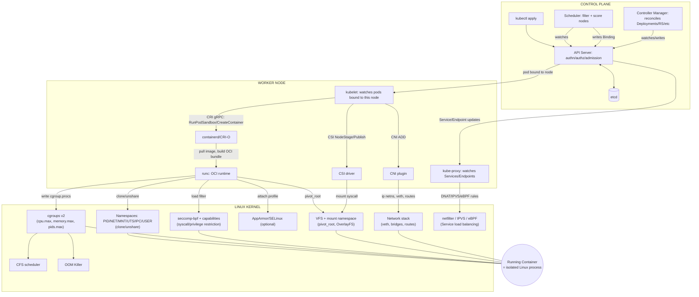
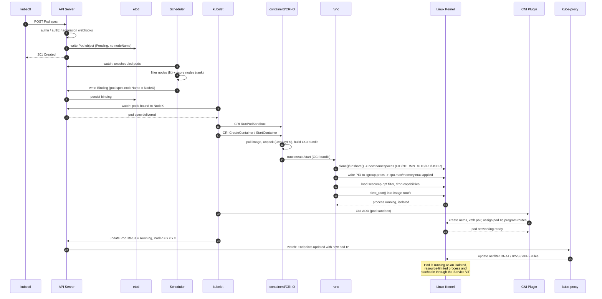

Here's the complete, detailed flow — control plane → worker node → kernel — broken into stages, with both diagrams.

## Stage 1: Control Plane — Object Creation & Storage

When you run `kubectl apply -f pod.yaml`:

1. `kubectl` sends an HTTPS request to the **API server**, which is the *only* component allowed to talk to **etcd**.
2. The API server runs the request through: **authentication** (who are you) → **authorization/RBAC** (are you allowed to do this) → **admission controllers** (mutating webhooks can inject defaults like sidecars; validating webhooks can reject the object, e.g. OPA/Kyverno policies).
3. The object is validated against the schema and written to **etcd** as a key-value entry (e.g., `/registry/pods/default/mypod`).
4. The API server doesn't "do" anything else — it's a REST front-end + watch broker. Every other component (scheduler, kubelet, controllers) is a **client** that watches the API server for changes via long-lived HTTP watch connections.

At this point the Pod object exists but has no `nodeName` — it's **Pending**.

## Stage 2: Scheduling

1. The **scheduler** watches the API server for pods with no `nodeName` assigned.
2. It runs two phases: **filtering** (which nodes can even run this pod — enough CPU/memory, matches node selectors, tolerates taints, satisfies affinity rules) and **scoring** (which of the remaining nodes is best — least loaded, spreads across zones, etc.).
3. It picks a node and writes a `Binding` object back to the API server, which sets `pod.spec.nodeName`. This is just another etcd write — the scheduler never talks to the node directly.

## Stage 3: kubelet Takes Over (Node-Level Reconciliation)

1. **kubelet** on the chosen node is watching the API server, filtered to pods bound to itself.
2. It sees the new pod and starts its **pod lifecycle sync loop**: pull secrets/configmaps it needs, then work through init containers, then main containers, in order.
3. kubelet does not create containers itself. It calls out to the **container runtime** over the **CRI (Container Runtime Interface)** — a gRPC API — asking for `RunPodSandbox`, then `CreateContainer`/`StartContainer` for each container.

## Stage 4: Container Runtime → OCI Runtime

1. **containerd** (or CRI-O) receives the CRI request. It pulls the image if not cached (layers stored via **OverlayFS** in `/var/lib/containerd`), unpacks it, and assembles an **OCI bundle** — a rootfs directory plus a `config.json` describing exactly what kernel features to apply (namespaces, cgroup path, capabilities, seccomp profile, mounts).
2. containerd hands this bundle to **runc** (the low-level OCI runtime — the actual thing that calls the kernel).

## Stage 5: runc → Linux Kernel (this is where it stops being abstract)

`runc` issues real syscalls:

- **`clone()`/`unshare()`** with flags like `CLONE_NEWPID | CLONE_NEWNET | CLONE_NEWNS | CLONE_NEWUTS | CLONE_NEWIPC | CLONE_NEWUSER` → this creates the six **namespaces** that make a process believe it's alone on a machine (its own PID tree, its own network stack, its own mount table, etc.)
- Writes the new process's PID into `cgroup.procs` under `/sys/fs/cgroup/kubepods/<qos-class>/<pod-uid>/<container-id>/` → this is the literal mechanism by which `resources.requests`/`resources.limits` in your YAML become kernel-enforced **cgroup v2** limits (`cpu.max`, `memory.max`, `pids.max`)
- **`pivot_root()`** into the unpacked image rootfs → filesystem isolation
- Loads a **seccomp-bpf** filter restricting which syscalls the container process is even allowed to make
- Drops **Linux capabilities** down from root's full power to a minimal set (e.g. removes `CAP_SYS_ADMIN`, `CAP_NET_RAW` unless the pod spec explicitly requests them)
- Optionally attaches an **AppArmor** or **SELinux** profile for mandatory access control

Once this returns, the "container" is just a normal Linux process — `ps aux` on the host would actually show it — that happens to have namespaces + cgroups + seccomp wrapped around it. There's no separate "container" object in the kernel.

## Stage 6: Networking — CNI + kube-proxy

- **CNI plugin** (Calico/Cilium/Flannel) runs a separate step: creates a network namespace for the pod, creates a **veth pair** (one end inside the pod's netns, one on the host bridge), assigns the pod IP, and programs routes so cross-node pod traffic works (via VXLAN encapsulation, BGP, or eBPF depending on the CNI).
- **kube-proxy**, independently, watches Service/Endpoint objects and programs **netfilter** (iptables mode) or the kernel's **IPVS** module (or eBPF, with Cilium) so that traffic to a Service's virtual IP gets load-balanced (DNAT'd) to one of the real pod IPs.

## Stage 7: Storage — CSI

If the pod has volumes, kubelet calls the **CSI driver** (`NodeStageVolume`/`NodePublishVolume`), which runs actual `mount` syscalls to attach the volume into the container's mount namespace. The kernel's **VFS** layer then makes it appear as a normal directory — the app inside has no idea it's a cloud disk.

## Stage 8: Ongoing Kernel Enforcement

Once running, the kernel keeps enforcing everything continuously — no Kubernetes component is "watching" this in real time:
- The **CFS scheduler** throttles CPU if the process exceeds `cpu.max`
- The **OOM killer** kills the process if it exceeds `memory.max` (this is exactly what produces `OOMKilled`, exit code 137/`SIGKILL`)
- kubelet's built-in **cAdvisor** just reads live numbers back out of `/proc` and `/sys/fs/cgroup` to power `kubectl top` and the metrics pipeline

---

## Flow Diagram: Control Plane → Node → Kernel

## Sequence Diagram: Pod Startup End-to-End

---

Here's a step-by-step walkthrough of what's actually happening at each line of that sequence diagram — this is the real, literal chronological order of events when a pod starts.

## Step 1-4: Object Creation (kubectl → API Server → etcd)

**1. `kubectl` → API Server: POST Pod spec**
You run `kubectl apply -f pod.yaml`. This gets serialized into JSON and sent as an HTTPS request to the API server. `kubectl` itself does nothing clever — it's just a REST client.

**2. API Server: authn / authz / admission webhooks**
The API server runs the request through a pipeline before touching storage:
- **Authentication** — who is this? (client cert, bearer token, OIDC)
- **Authorization** — is this identity allowed to `create` pods in this namespace? (RBAC check)
- **Admission control** — mutating webhooks can modify the object (e.g., inject a sidecar, set default resource limits), then validating webhooks can reject it outright (e.g., OPA/Kyverno blocking `:latest` tags or privileged containers)

**3. API Server → etcd: write Pod object**
Only now does the API server write the object to etcd, as a key like `/registry/pods/default/mypod`. At this point `pod.spec.nodeName` is empty — the pod exists conceptually but has nowhere to run.

**4. API Server → kubectl: 201 Created**
Your `kubectl apply` returns successfully. Note: this just means "the object was accepted and stored" — it says nothing about whether it will actually run successfully.

## Step 5-8: Scheduling

**5-6. Scheduler watches, filters, and scores**
The scheduler holds an open watch connection to the API server, filtered for pods where `nodeName` is unset. It picks this new pod up almost instantly. It then runs two phases:
- **Filter/Predicate phase**: eliminate nodes that can't work — insufficient CPU/memory, taints the pod doesn't tolerate, node selector mismatch, port conflicts
- **Score/Priority phase**: rank the surviving nodes — least requested resources, spread across zones/nodes for HA, affinity/anti-affinity preferences

**7-8. Scheduler writes Binding → etcd persists it**
The scheduler doesn't call the node directly — it just writes a `Binding` subresource back to the API server, setting `pod.spec.nodeName = NodeX`. That's it. The scheduler's job is now done; it never talks to kubelet.

## Step 9-10: kubelet Picks It Up

**9-10. kubelet watches → API server delivers the spec**
kubelet on NodeX has its own watch open, filtered to `nodeName == NodeX`. The moment the binding is written, kubelet's watch fires and it receives the full pod spec. This is the first moment the *node itself* knows anything about this pod.

## Step 11-14: Handing Off to the Container Runtime

**11. kubelet → containerd: CRI RunPodSandbox**
Before starting any app container, kubelet asks the runtime to create the **pod sandbox** — this is what actually sets up the shared network namespace that all containers in the pod will join (this is why containers in a pod share `localhost`).

**12. kubelet → containerd: CreateContainer/StartContainer**
For each container in the pod spec (init containers first, in order, then main containers), kubelet issues these CRI calls.

**13. containerd: pull image, unpack, build OCI bundle**
containerd pulls the image layers if not cached, unpacks them via OverlayFS, and assembles the **OCI bundle**: a rootfs directory plus a `config.json` that precisely describes what the kernel should do — which namespaces, which cgroup path, which capabilities, which seccomp profile.

**14. containerd → runc: create/start**
containerd hands this bundle off to `runc`, the low-level OCI runtime binary that will actually talk to the kernel.

## Step 15-19: runc Makes It Real

This is the part that's genuinely happening at the kernel level, not an abstraction:

**15. `clone()`/`unshare()`** — creates the six namespaces (PID, NET, MNT, UTS, IPC, USER). This is the single syscall that makes a process believe it's alone on the machine.

**16. Write PID to `cgroup.procs`** — this is the exact mechanism that turns your YAML's `resources.limits.memory: 512Mi` into an enforced kernel limit. runc writes the new process's PID into the cgroup hierarchy, and the kernel's memory controller starts tracking/enforcing from that point on.

**17. Load seccomp-bpf filter, drop capabilities** — restricts which syscalls this process can even attempt, and strips root down from full power to a minimal capability set.

**18. `pivot_root()`** — swaps the process's filesystem root into the unpacked image, so `/` inside the container is actually the image's rootfs on the host.

**19. Kernel confirms: process running, isolated**
At this exact moment, the "container" exists. It's genuinely just a Linux process — visible in `ps aux` on the host node — wrapped in namespaces and cgroups.

## Step 20-22: Networking Gets Wired Up

**20. kubelet → CNI: ADD**
Separately from the runc work, kubelet calls the CNI plugin to network the pod sandbox.

**21. CNI → kernel: netns, veth, IP, routes**
The CNI plugin creates a veth pair (one end in the pod's network namespace, one on the host), assigns the pod its IP from the cluster CIDR, and adds routes so traffic can reach other nodes' pods.

**22. Kernel confirms pod networking is ready**

## Step 23-25: Becoming Reachable

**23. kubelet → API server: status = Running, PodIP = x.x.x.x**
kubelet reports back what actually happened. This is also when `kubectl get pods` starts showing `Running` and a real IP.

**24. API server → kube-proxy: Endpoints updated**
Any Service selecting this pod's labels now gets a new Endpoint entry containing this pod's IP. kube-proxy, which has its own watch on Services/Endpoints, picks this up immediately.

**25. kube-proxy → kernel: update netfilter/IPVS/eBPF rules**
kube-proxy programs new load-balancing rules so that traffic hitting the Service's virtual IP can now be DNAT'd to this pod's real IP alongside any siblings.

**Why the order matters:** container creation (steps 11-19) and network setup (steps 20-22) are largely independent CRI/CNI calls — but the pod isn't truly "ready to serve traffic" until *all three* have completed: the process is running, its network namespace has an IP, and kube-proxy has propagated that IP into the Service's load-balancing rules. A pod can show `Running` in step 23 before step 25 finishes — which is exactly why a freshly-started pod can be up but briefly unreachable via its Service.

---

**The core mental model:** the control plane is a pure decision-making/state-storage layer that never touches a kernel. kubelet is the bridge — it turns "this pod should run here" into CRI calls. containerd/runc are the translators that turn that into literal `clone()`, cgroup writes, and seccomp filters. CNI and kube-proxy independently wire up the kernel's network stack. Everything after that point — resource enforcement, OOM kills, service routing — is the kernel running its normal subsystems; Kubernetes just configured them correctly ahead of time and now watches from the outside via `/proc` and `/sys`.
