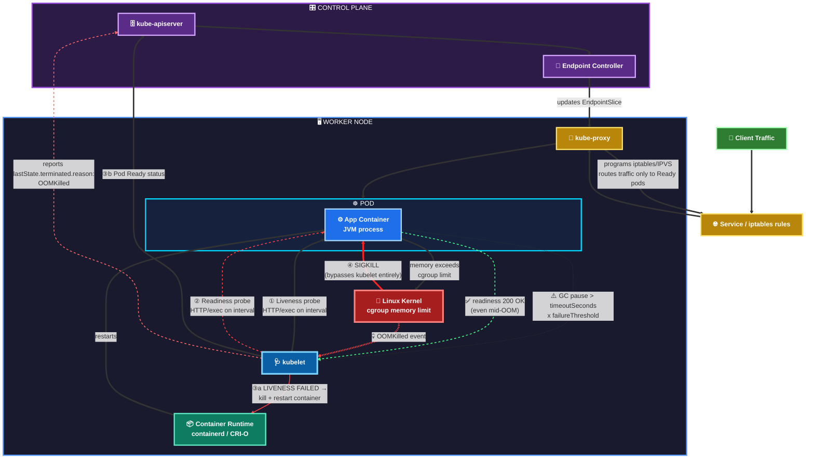
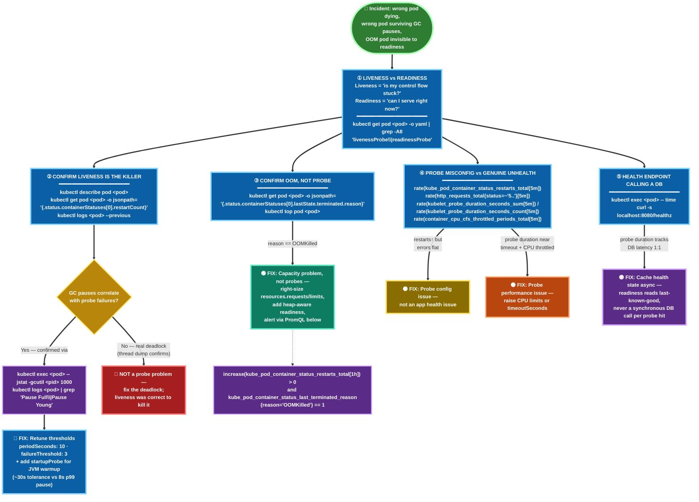

```
**The question:**

"We had an incident last quarter where a Java service running on Kubernetes started getting OOMKilled and restarted in a crash loop during peak traffic, but the readiness probe kept marking pods as healthy right up until they died — so the load balancer was still routing traffic to pods that were seconds away from getting killed. Meanwhile, a *different* service on the same cluster had the opposite problem: its liveness probe was too aggressive, and pods were getting killed and restarted during normal GC pauses, even though the service was fine.

Walk me through how you'd diagnose and fix both of these. Specifically:

1. What's actually different between what a liveness probe and a readiness probe should be checking — not the textbook definition, but how you'd design the check logic differently for each?
2. For the GC-pause case — how do you set `initialDelaySeconds`, `periodSeconds`, `timeoutSeconds`, and `failureThreshold` so you're not flapping on transient pauses, without making the liveness probe so lenient it stops catching real deadlocks?
3. For the OOM case — readiness probes can't predict a memory spike. What would you actually change here? Is this a probe tuning problem at all, or something else?
4. How would you tell the difference, from Grafana/Prometheus metrics alone, between 'probe is misconfigured' and 'the app itself is genuinely unhealthy'?
5. If your health check endpoint itself makes a downstream DB call, what failure mode does that introduce, and how do you avoid it?"

---
## Model Answer

**1. Liveness vs. Readiness — the real distinction**

Textbook answer is "liveness restarts, readiness removes from load balancing." The senior-level distinction is about what each check is allowed to *depend on*.

A liveness probe should only answer one question: *"Is this process's own control flow stuck?"* — deadlock, hung thread pool, event loop blocked. It should never call out to a database, cache, or downstream service, because then you're not measuring the app's liveness, you're measuring the network's liveness, and you'll kill perfectly healthy pods because Postgres had a blip.

A readiness probe should answer: *"Can this pod correctly serve a request right now?"* — which legitimately can depend on downstream health (DB connection pool has available connections, cache is warm, config loaded). It's fine for readiness to flap; that's its job. It's not fine for liveness to flap.

**2. Fixing the GC-pause flapping (liveness too aggressive)**

- Root cause: `periodSeconds`/`timeoutSeconds`/`failureThreshold` combination gives less total tolerance than a normal GC pause under load.
- Fix the math, not just one knob: total tolerance = `periodSeconds × failureThreshold` (plus `timeoutSeconds` per attempt). If p99 GC pause is 8s, you want tolerance comfortably above that — e.g. `periodSeconds: 10`, `failureThreshold: 3`, `timeoutSeconds: 5` gives ~30s of tolerance instead of a naive `periodSeconds: 5, failureThreshold: 1` giving 5s.
- Use a **startup probe** for JVM warm-up instead of stretching `initialDelaySeconds` — that decouples "slow to start" from "slow to respond once started," which is what actually causes people to over-loosen liveness and mask real deadlocks.
- If you have G1GC pause data in Prometheus, size the threshold off p99.9 pause time, not a guess.

**3. Fixing the OOM case — this is not a probe tuning problem**

Readiness can't see memory pressure coming; by the time a request fails, the pod is already dying. Reframing the fix:
- Set proper `resources.requests`/`limits` and get an OOMKilled alert on `kube_pod_container_status_last_terminated_reason` — this is a capacity/rightsizing problem, not a probe problem.
- Add a **readiness check that reflects backpressure**, not just "is the HTTP server up" — e.g. reject readiness if heap usage crosses a threshold (`-XX:+PrintGCDetails` / expose JVM heap via actuator) so the pod is pulled from rotation *before* OOMKill, not after.
- Consider `terminationGracePeriodSeconds` + a `preStop` hook that flips readiness to false immediately on SIGTERM, so in-flight requests drain instead of getting dropped mid-response.
- Longer-term: HPA on memory, or profiling for a leak if OOMKills correlate with uptime rather than traffic volume.

**4. Telling "probe misconfigured" apart from "app genuinely unhealthy" in metrics**

- Correlate `kube_pod_container_status_restarts_total` against actual application error rate / latency (from app-level Prometheus metrics, not just kubelet events). If restarts spike but app-level 5xx and p99 latency are flat right before the restart — that's a probe config problem.
- Check `kubelet_probe_duration_seconds` (or equivalent) against `timeoutSeconds` — if probe latency is regularly close to the timeout, you have a probe performance problem, not a health problem.
- Overlay GC pause metrics / CPU throttling (`container_cpu_cfs_throttled_periods_total`) against restart timestamps — CPU throttling causing slow probe responses is one of the most common "fake unhealthy" causes in Kubernetes and is invisible unless you specifically go looking for throttling metrics.

**5. Health endpoint calling a downstream DB — the failure mode**

This creates a **cascading failure amplifier**: if the DB gets slow (not down, just slow), every pod's health check starts timing out simultaneously, Kubernetes marks every pod not-ready or kills every pod at once, and you've turned one slow dependency into a total outage — the exact opposite of what health checks are supposed to prevent.

Fix: separate the concerns. Liveness never touches the DB. Readiness can check DB connectivity but should use a **cached/async health state** (a background goroutine/thread pings the DB every N seconds and the probe just reads the last known state) rather than making a synchronous DB call on every probe hit — so probe traffic itself doesn't add load to an already-struggling DB, and a DB blip doesn't instantly cascade into every pod being pulled from rotation at once.

---

## The 5 Ws

**Who** is this answer for — a candidate at the senior SRE / platform / backend infra level being evaluated on whether they've actually operated Kubernetes in production, not just deployed a YAML file from a tutorial. The bar isn't "do you know probes exist," it's "have you been paged for this."

**What** is actually being tested — not probe syntax, but judgment: knowing that liveness and readiness serve fundamentally different purposes, that probe tuning is a math problem (rate × threshold = tolerance window) not knob-twiddling, and that some failures (like OOM) aren't probe problems at all — they're capacity or architecture problems disguised as probe problems. That last distinction is the real signal the interviewer is fishing for.

**When** does this scenario happen in real systems — almost always under peak load, which is precisely when GC pauses lengthen, connection pools saturate, and CPU throttling kicks in. The interviewer picked peak traffic deliberately, because probe misconfigurations that are invisible at low load become outages at high load.

**Where** does the failure actually live — not in the Kubernetes probe config alone, but at the boundary between the app's internal state (heap, GC, thread pool) and the orchestrator's external view of it (HTTP 200/500). Good answers keep pointing back to that boundary; weak answers stay entirely inside the YAML.

**Why** this question gets asked — because probe misconfiguration is one of the most common **self-inflicted** outages in Kubernetes shops: nobody attacked the system, no dependency truly failed, the platform itself killed healthy capacity. Interviewers use it because it cheaply reveals whether a candidate has actually debugged a crash-loop at 2am or has only ever read the Kubernetes docs page on probes.

```




```
## The core architecture pieces involved

**kubelet** — runs on every node, is the *only* component that actually executes probes. It doesn't ask the API server "is this pod healthy" — it directly execs into or HTTP-calls the container itself, on the interval you configured.

**Container runtime (containerd/CRI-O)** — kubelet talks to this to actually kill/restart a container when a liveness probe fails enough times.

**kube-apiserver** — kubelet writes probe *results* here as pod status/conditions (`Ready` condition), it doesn't execute probes itself.

**Endpoint controller** — watches the API server for pod `Ready` status changes and updates the **Endpoints/EndpointSlice** object for the Service — this is where readiness actually takes effect.

**kube-proxy** — watches EndpointSlice objects and programs iptables/IPVS rules on every node so Service traffic only gets routed to Ready pods.

**cgroups / OOM killer (kernel-level, not Kubernetes)** — this is the part most people miss: OOMKill is not Kubernetes deciding to kill your pod. It's the **Linux kernel** killing the process because it exceeded its cgroup memory limit, and kubelet just observes and reports it after the fact via `containerStatuses.lastState.terminated.reason: OOMKilled`. No probe is involved at all in this path — which is exactly why "tune the probe" doesn't fix the OOM scenario.

## Mapping the two incidents onto this architecture

**GC-pause / liveness-too-aggressive case:** kubelet execs the liveness probe → JVM is mid-GC-pause and doesn't respond within `timeoutSeconds` → after `failureThreshold` consecutive failures, kubelet tells the container runtime to kill the container → container runtime restarts it → kubelet resets probe state and starts the whole cycle again. The **Service, Endpoints, and kube-proxy are never involved** in this failure — this is purely a kubelet ↔ container-runtime loop, which is why fixing it is 100% about `periodSeconds`/`timeoutSeconds`/`failureThreshold` math.

**OOM / readiness-blind-to-memory case:** memory grows past the cgroup limit → kernel OOM killer sends SIGKILL directly to the process, bypassing kubelet entirely → kubelet notices the container is gone on its next sync loop and reports it → meanwhile, readiness probe was returning 200 right up until the SIGKILL because HTTP handling was fine — memory pressure and request-handling health are decoupled unless you explicitly wire them together. This is why the fix has to happen *inside the app* (heap-aware readiness) or *at the resource layer* (limits/HPA), not in probe YAML.

Here's the full flow as a diagram:How to read it: the top path (steps 1–3a/3b) is entirely a **kubelet-driven control loop** — probes, restart decisions, and Endpoint updates never touch the kernel. The bottom path (step 4) is a **kernel-driven event** that kubelet only *observes after the fact* — it never gets a vote. That's the architectural reason "tune the probe" fixes one incident and does nothing for the other: liveness/readiness live in userspace orchestration, OOMKill lives below it, at the cgroup/kernel boundary Kubernetes doesn't control.

One detail worth calling out for the interview answer itself: notice that **readiness failing** only ever changes the EndpointSlice/iptables rules (traffic routing) — it never restarts anything. Only **liveness failing** reaches the container runtime and causes a kill/restart. Candidates who mix this up (say readiness failure restarts the pod) are an easy tell for an interviewer that the person hasn't actually debugged this in production.

```



```
Here's a decision-flow diagram of the **troubleshooting logic** from the model answer — i.e., how you'd actually walk through diagnosing and fixing either failure mode from scratch.The first fork (**killed vs. just not-ready**) is the single most important triage question in this entire diagram — it immediately tells you whether you're in liveness territory (restart path) or readiness territory (routing path), which is exactly the distinction most candidates blur under interview pressure.

From there it branches into the two incidents from the original question:
- **Left branch (liveness):** splits into "it's actually a probe tuning problem" (blue fix) vs. "the app is genuinely broken and the probe was right to kill it" (red — a trap a lot of candidates fall into by reflexively loosening thresholds instead of checking whether the kill was justified) vs. the OOM path, which explicitly routes to **"not a probe problem at all"** (green).
- **Right branch (readiness):** the DB-call-in-health-check trap gets its own dedicated fork (purple fix — async caching), and the bottom-right red box is the OOM-adjacent case where readiness was blind to a real problem, mapping back to answer #3's "make readiness backpressure-aware" fix.
```

